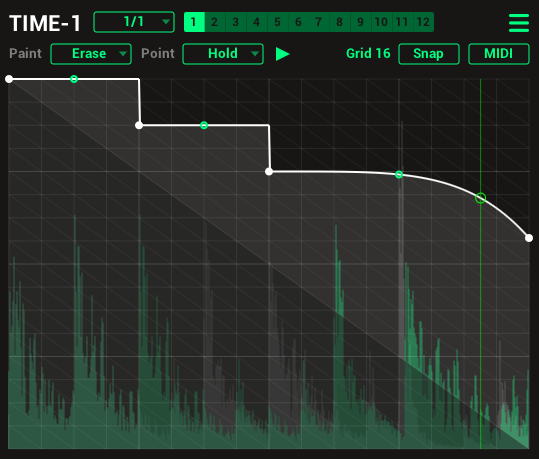

# TIME1

TIME1 is an open source delay modulator similar to plugins like GrossBeat or TimeShaper.
Can be used for stutter effects, tape stop, glitch, scratch, reverse, pitch shift and more.
It is a port of [TIME-1 JSFX](https://github.com/tiagolr/tilr_jsfx?tab=readme-ov-file#time-1) to C++ using [Iplug2](https://iplug2.github.io/)

* [Download VST3 (Windows Only)](https://github.com/tiagolr/time1/raw/master/dist/TIME1.vst3)
* [Download CLAP (Windows Only)](https://github.com/tiagolr/time1/raw/master/dist/TIME1.clap)

#### Features:

* Multi-segment editor
* 12 patterns triggered by midi notes
* Paint mode - erase, line, saw up, saw down ..
* Point type - hold, curve, s-curve, stairs ..
* Anti clicking with 3 modes (Off, Low, High)
* Pre and post waveform display
* MIDI trigger mode
